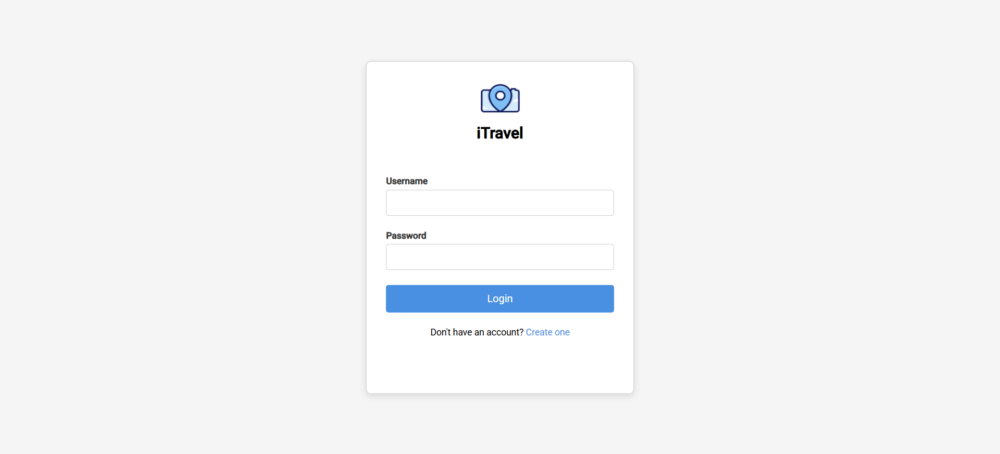

# iTravel

Welcome to the iTravel project! This project consists of two main components:
- **Frontend**: Built with Angular v18.
- **Backend**: Built with ExpressJS.

## Repository

The source code for this project is available on GitHub:
https://github.com/daniellima0/iTravel/

## Prerequisites
Before running the project, ensure you have the following installed on your system:

- [Node.js](https://nodejs.org/) (v16 or later recommended)
- npm (comes with Node.js)

## Project Structure
The project has the following structure:

```
/
|-- /frontend    # Angular frontend
|-- /backend     # ExpressJS backend
|-- /images      # Screenshots of the project
|-- README.md    # Project documentation
```

## Screenshots

### Login Page


### Create Account Page


### Homepage


### My Photos Page


## Setting Up and Running the Project

### Frontend
1. Navigate to the `frontend` directory:
   ```bash
   cd frontend
   ```

2. Install the required dependencies:
   ```bash
   npm install
   ```

3. Start the Angular development server:
   ```bash
   npm start
   ```

4. The frontend application will be available at `http://localhost:4200` by default.

### Backend
1. Navigate to the `backend` directory:
   ```bash
   cd backend
   ```

2. Install the required dependencies:
   ```bash
   npm install
   ```

3. Start the ExpressJS server:
   ```bash
   node ./index.js
   ```

4. The backend server will be available at `http://localhost:3000` by default (or the port specified in your code).

## Additional Notes
- Ensure both the frontend and backend are running simultaneously for the application to function correctly.
- Adjust configurations (e.g., API endpoints) if necessary to ensure proper communication between the frontend and backend.

## Troubleshooting
If you encounter issues, ensure you have the correct versions of Node.js and npm installed. You can check your installed versions using:

```bash
node -v
npm -v
```

If issues persist, consult the logs output by the frontend and backend servers for debugging information.

---

Happy coding!

